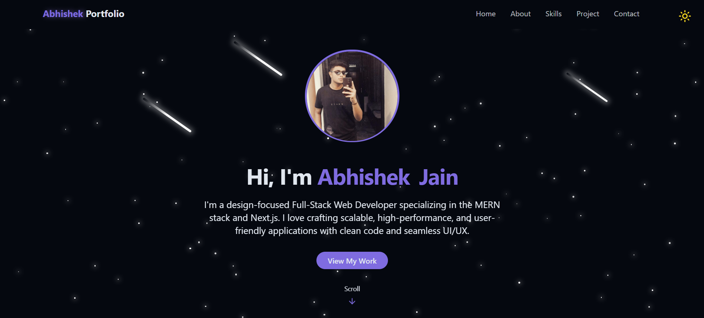

# 🚀 Abhishek Jain - Portfolio

Welcome to my personal portfolio! This website showcases my skills, projects, and experience as a **Full-Stack Developer**.

---
## 🌟 Live Preview

Check out the live version of my portfolio:
[🔗 View Portfolio](https://abhishekjain83.vercel.app/)

## 📸 Screenshots



  <br />
  <div>
    
    
    
    
    
  </div>
  <br />
</div>

---

## ⚙️ Tech Stack

* **React** – Component-based UI development
* **Vite** – Lightning-fast build tool
* **TailwindCSS** – Utility-first CSS for styling
* **Lucide Icons** – Clean and beautiful icon pack
* **Radix UI** – Accessible component primitives
* **TypeScript (optional)** – Type safety and tooling
* **GitHub & Vercel** – Deployment

---

## ⚡️ Features

* 🌑 **Light/Dark Mode Toggle**
  Save theme preference in local storage with beautiful transitions

* 💫 **Animated Backgrounds**
  Stars, meteors, scroll effects, and glowing UI elements

* 📱 **Responsive Navigation**
  Desktop and mobile menus with glassmorphism

* 👨‍💻 **Hero & About Sections**
  Showcase who you are with smooth intro animations and buttons

* 📊 **Skills Grid**
  Filterable progress bars and categories with animated width

* 🖼️ **Projects Showcase**
  Display screenshots, tech stacks, and GitHub/demo links

* 📩 **Contact Section**
  Social icons + responsive contact form with toast notifications

* 🚀 **One-Click Deployment**
  Easily host your site with Vercel and GitHub

---

## 👌 Quick Start

### Prerequisites

* [Node.js](https://nodejs.org/)
* [Git](https://git-scm.com/)

### Clone and Run

```bash
git clone https://github.com/AeeJayy83/Portfolio-Website.git
cd MyPortfolio
npm install
npm run dev
```

Your app will be available at: [http://localhost:5173](http://localhost:5173)

---

## 🔥 Contributing

## Feel free to fork this repository, open issues, or submit pull requests.

💙 Made with passion by **Abhishek Jain**

